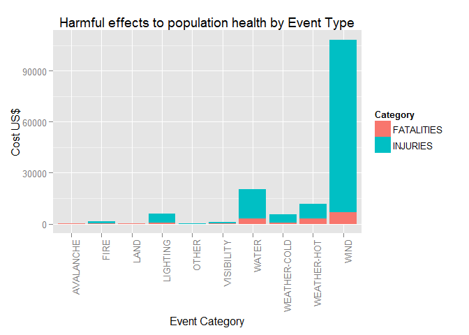
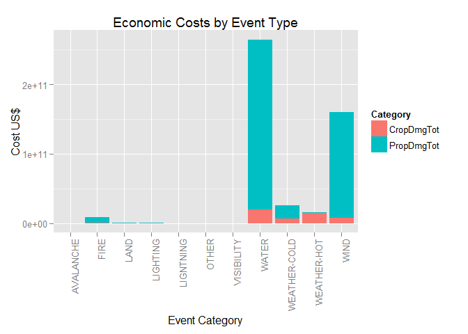

# Economic and Life-Threatening Events as a result of Storm Activities in the USA
Alan C Bonnici  
Monday, August 18, 2014  


## Introduction

Storms and other severe weather events can cause both public health and economic problems for communities and municipalities. Many severe events can result in fatalities, injuries, and property damage, and preventing such outcomes to the extent possible is a key concern.

### Assignment

The purpose of this report is to answer the following questions:

1. Across the United States, which types of events are most harmful with respect to population health?
2. Across the United States, which types of events have the greatest economic consequences?


### Data


This project involves exploring the U.S. National Oceanic and Atmospheric Administration's (NOAA) storm database. This database tracks characteristics of major storms and weather events in the United States, including when and where they occur, as well as estimates of any fatalities, injuries, and property damage.

The data used is this analysis was downloaded from https://d396qusza40orc.cloudfront.net/repdata%2Fdata%2FStormData.csv.bz2. It was downloaded on **Aug 18 2014 at 13:46:13**.


The data on which this report is based consists of **902,297** observations. The period covered by the data is between **NA** and **NA**.

\newpage

##Across the United States, which types of events are most harmful with respect to population health?


```r
data2 <- data[data$INJURIES > 0 | data$FATALITIES>0,c("EVTYPE", "FATALITIES", "INJURIES")]
```

Procedure: a subset of the original data was extracted from the original source. This consisted of only those rows that reported INJURIES or FATALITIES greater than zero. The resulting subset consisted of **21,929** observations. 

The Event Type description (*EVTYPE*) was not coded against a fixed list. This meant that there were many items that overlapped and this would confound the results. The original list of reported Event Types in the subset was the following:


```r
unique(data2$EVTYPE)
```

```
##   [1] "TORNADO"                        "TSTM WIND"                     
##   [3] "HAIL"                           "ICE STORM/FLASH FLOOD"         
##   [5] "WINTER STORM"                   "HURRICANE OPAL/HIGH WINDS"     
##   [7] "DENSE FOG"                      "RIP CURRENT"                   
##   [9] "THUNDERSTORM WINDS"             "LIGHTNING"                     
##  [11] "HEAT"                           "HEAVY RAIN"                    
##  [13] "COLD"                           "FLOODING"                      
##  [15] "FLASH FLOOD"                    "EXTREME COLD"                  
##  [17] "HIGH WIND"                      "MARINE MISHAP"                 
##  [19] "HIGH WIND/SEAS"                 "HIGH SEAS"                     
##  [21] "HIGH WINDS"                     "DUST STORM"                    
##  [23] "SLEET"                          "FLOOD"                         
##  [25] "THUNDERSTORM WINDS/HAIL"        "EXCESSIVE HEAT"                
##  [27] "GUSTY WINDS"                    "HIGH SURF"                     
##  [29] "WILD FIRES"                     "HIGH"                          
##  [31] "WINTER STORM HIGH WINDS"        "WINTER STORMS"                 
##  [33] "THUNDERSTORM WIND"              "FLOOD/FLASH FLOOD"             
##  [35] "HEAVY SNOW"                     "FUNNEL CLOUD"                  
##  [37] "STRONG WIND"                    "DRY MIRCOBURST WINDS"          
##  [39] "DRY MICROBURST"                 "THUNDERSTORM WINDSS"           
##  [41] "ICE STORM"                      "HEAT WAVE"                     
##  [43] "UNSEASONABLY WARM"              "STRONG WINDS"                  
##  [45] "BLIZZARD"                       "WATERSPOUT TORNADO"            
##  [47] "HURRICANE ERIN"                 "WATERSPOUT/TORNADO"            
##  [49] "WIND"                           "STORM SURGE"                   
##  [51] "WATERSPOUT"                     "HURRICANE OPAL"                
##  [53] "TORNADOES, TSTM WIND, HAIL"     "TROPICAL STORM"                
##  [55] "TROPICAL STORM GORDON"          "LIGHTNING INJURY"              
##  [57] "LIGHTNING AND THUNDERSTORM WIN" "AVALANCHE"                     
##  [59] "THUNDERSTORM WINDS 13"          "FLASH FLOODING"                
##  [61] "SNOW"                           "FREEZING RAIN/SNOW"            
##  [63] "THUNDERSNOW"                    "RIVER FLOOD"                   
##  [65] "EXTREME HEAT"                   "WINDS"                         
##  [67] "FREEZING RAIN"                  "FOG"                           
##  [69] "SNOW AND ICE"                   "WIND STORM"                    
##  [71] "ICE"                            "WINTER WEATHER"                
##  [73] "URBAN AND SMALL STREAM FLOODIN" "FREEZE"                        
##  [75] "LIGHTNING."                     "HURRICANE-GENERATED SWELLS"    
##  [77] "THUNDERTORM WINDS"              "COLD WAVE"                     
##  [79] "TORNADO F3"                     "FLOOD/RIVER FLOOD"             
##  [81] "GLAZE/ICE STORM"                "AVALANCE"                      
##  [83] "HEAVY SNOW AND HIGH WINDS"      "RIP CURRENTS/HEAVY SURF"       
##  [85] "FOG AND COLD TEMPERATURES"      "DUST DEVIL"                    
##  [87] "HEAVY SURF"                     "ICY ROADS"                     
##  [89] "RECORD HEAT"                    "TORNADO F2"                    
##  [91] "RIP CURRENTS"                   "HURRICANE EMILY"               
##  [93] "HURRICANE FELIX"                "THUNDERSTORM"                  
##  [95] "BLOWING SNOW"                   "HIGH WIND/HEAVY SNOW"          
##  [97] "RAIN/WIND"                      "HEAT WAVE DROUGHT"             
##  [99] "HEAVY SNOW/BLIZZARD/AVALANCHE"  "HEAT WAVES"                    
## [101] "UNSEASONABLY WARM AND DRY"      "UNSEASONABLY COLD"             
## [103] "RECORD/EXCESSIVE HEAT"          "THUNDERSTORM WIND G52"         
## [105] "HIGH WAVES"                     "LOW TEMPERATURE"               
## [107] "HYPOTHERMIA"                    "COLD/WINDS"                    
## [109] "RECORD COLD"                    "SNOW/ BITTER COLD"             
## [111] "HIGH WINDS/COLD"                "COLD WEATHER"                  
## [113] "RAPIDLY RISING WATER"           "HEAVY RAINS"                   
## [115] "HEAVY SNOW/ICE"                 "SNOW/HIGH WINDS"               
## [117] "HIGH WINDS/SNOW"                "FREEZING DRIZZLE"              
## [119] "FLASH FLOOD/FLOOD"              "EXCESSIVE RAINFALL"            
## [121] "THUNDERSTORMW"                  "FLASH FLOODING/FLOOD"          
## [123] "GLAZE"                          "LANDSLIDE"                     
## [125] "HIGH WIND AND SEAS"             "RIVER FLOODING"                
## [127] "MINOR FLOODING"                 "DROUGHT/EXCESSIVE HEAT"        
## [129] "HEAVY SEAS"                     "FLOOD & HEAVY RAIN"            
## [131] "THUNDERSTORM  WINDS"            "HIGH WIND 48"                  
## [133] "THUNDERSTORMS WINDS"            "FLASH FLOODS"                  
## [135] "URBAN/SML STREAM FLD"           "ROUGH SURF"                    
## [137] "WILD/FOREST FIRE"               "MARINE ACCIDENT"               
## [139] "COASTAL STORM"                  "HURRICANE"                     
## [141] "TORRENTIAL RAINFALL"            "HURRICANE EDOUARD"             
## [143] "TIDAL FLOODING"                 "EXTENDED COLD"                 
## [145] "EXTREME WINDCHILL"              "WHIRLWIND"                     
## [147] "HEAVY SNOW SHOWER"              "MIXED PRECIP"                  
## [149] "FREEZING SPRAY"                 "TSTM WIND/HAIL"                
## [151] "MUDSLIDES"                      "MUDSLIDE"                      
## [153] "COLD TEMPERATURE"               "COASTAL FLOODING"              
## [155] "COLD AND SNOW"                  "RAIN/SNOW"                     
## [157] "SNOW SQUALL"                    "HYPOTHERMIA/EXPOSURE"          
## [159] "BLACK ICE"                      "COASTALSTORM"                  
## [161] "FROST"                          "SNOW SQUALLS"                  
## [163] "HEAVY SURF AND WIND"            "TYPHOON"                       
## [165] "LANDSLIDES"                     "HIGH SWELLS"                   
## [167] "SMALL HAIL"                     "COASTAL FLOODING/EROSION"      
## [169] "TSTM WIND (G40)"                "TSTM WIND (G35)"               
## [171] "HYPERTHERMIA/EXPOSURE"          "WINTRY MIX"                    
## [173] "GUSTY WIND"                     "EXCESSIVE SNOW"                
## [175] "ICE ROADS"                      "ROUGH SEAS"                    
## [177] "TSTM WIND (G45)"                "NON-SEVERE WIND DAMAGE"        
## [179] "WARM WEATHER"                   "THUNDERSTORM WIND (G40)"       
## [181] "HIGH WATER"                     "LIGHT SNOW"                    
## [183] "WINTER WEATHER MIX"             "ROGUE WAVE"                    
## [185] "FALLING SNOW/ICE"               "NON TSTM WIND"                 
## [187] "OTHER"                          "BRUSH FIRE"                    
## [189] "HAZARDOUS SURF"                 "ICE ON ROAD"                   
## [191] "DROWNING"                       "EXTREME COLD/WIND CHILL"       
## [193] "HURRICANE/TYPHOON"              "WILDFIRE"                      
## [195] "HEAVY SURF/HIGH SURF"           "WINTER WEATHER/MIX"            
## [197] "MARINE TSTM WIND"               "COASTAL FLOOD"                 
## [199] "DROUGHT"                        "COLD/WIND CHILL"               
## [201] "MARINE THUNDERSTORM WIND"       "MARINE STRONG WIND"            
## [203] "STORM SURGE/TIDE"               "MARINE HIGH WIND"              
## [205] "TSUNAMI"
```

After the list was consolidated, the number of groupings are the following:


```r
data2 <- cleanEVTYPE(data2)
unique(data2$EVTYPE)
```

```
##  [1] WIND         WEATHER-COLD WATER        VISIBILITY   LIGHTING    
##  [6] WEATHER-HOT  FIRE         OTHER        AVALANCHE    LAND        
## 10 Levels: AVALANCHE FIRE LAND LIGHTING OTHER VISIBILITY ... WIND
```

 


From the chart it is clearly visble that the event that costs the most in terms of harmful events to humans are those classified under **WIND**.

The table of the recategorised data is shown hereunder


```
##       EventType Amount
## 5         OTHER    228
## 3          LAND    261
## 1     AVALANCHE    396
## 6    VISIBILITY   1156
## 2          FIRE   1698
## 8  WEATHER-COLD   5417
## 4      LIGHTING   6048
## 9   WEATHER-HOT  11793
## 7         WATER  20372
## 10         WIND 108304
```
\newpage

##Across the United States, which types of events have the greatest economic consequences?


Procedure: a subset of the original data was extracted from the original source. This consisted of only those rows that reported INJURIES or FATALITIES greater than zero. The resulting subset consisted of **245,031** observations. 

The Event Type description (*EVTYPE*) was not coded against a fixed list. This meant that there were many items that overlapped and this would confound the results. The original list of reported Event Types in the subset was the following:


```r
unique(data3$EVTYPE)
```

```
##   [1] "TORNADO"                        "WINTER STORM"                  
##   [3] "HURRICANE OPAL/HIGH WINDS"      "THUNDERSTORM WINDS"            
##   [5] "HURRICANE ERIN"                 "HURRICANE OPAL"                
##   [7] "HEAVY RAIN"                     "LIGHTNING"                     
##   [9] "THUNDERSTORM WIND"              "DENSE FOG"                     
##  [11] "HAIL"                           "THUNDERSTORM WINS"             
##  [13] "FLASH FLOODING"                 "FLASH FLOOD"                   
##  [15] "TORNADO F0"                     "THUNDERSTORM WINDS LIGHTNING"  
##  [17] "THUNDERSTORM WINDS/HAIL"        "HIGH WINDS"                    
##  [19] "WIND"                           "HEAVY RAINS"                   
##  [21] "LIGHTNING AND HEAVY RAIN"       "THUNDERSTORM WINDS HAIL"       
##  [23] "HEAVY RAIN/LIGHTNING"           "FLASH FLOODING/THUNDERSTORM WI"
##  [25] "FLOODING"                       "WATERSPOUT"                    
##  [27] "HEAT"                           "LIGHTNING/HEAVY RAIN"          
##  [29] "BREAKUP FLOODING"               "HIGH WIND"                     
##  [31] "FREEZE"                         "RIVER FLOOD"                   
##  [33] "HIGH WINDS HEAVY RAINS"         "AVALANCHE"                     
##  [35] "HIGH TIDES"                     "HIGH WIND/SEAS"                
##  [37] "HIGH WINDS/HEAVY RAIN"          "HIGH SEAS"                     
##  [39] "COASTAL FLOOD"                  "SEVERE TURBULENCE"             
##  [41] "RECORD RAINFALL"                "HEAVY SNOW"                    
##  [43] "HEAVY SNOW/WIND"                "FLOOD"                         
##  [45] "APACHE COUNTY"                  "DUST DEVIL"                    
##  [47] "DUST STORM"                     "ICE STORM"                     
##  [49] "TSTM WIND"                      "THUNDERSTORM WINDS/FUNNEL CLOU"
##  [51] "GUSTY WINDS"                    "FLOODING/HEAVY RAIN"           
##  [53] "HEAVY SURF COASTAL FLOODING"    "WILD FIRES"                    
##  [55] "WINTER STORM HIGH WINDS"        "WINTER STORMS"                 
##  [57] "MUDSLIDES"                      "RAINSTORM"                     
##  [59] "SEVERE THUNDERSTORM"            "SEVERE THUNDERSTORMS"          
##  [61] "SEVERE THUNDERSTORM WINDS"      "THUNDERSTORMS WINDS"           
##  [63] "FLOOD/FLASH FLOOD"              "FLOOD/RAIN/WINDS"              
##  [65] "THUNDERSTORMS"                  "FLASH FLOOD WINDS"             
##  [67] "WINDS"                          "FUNNEL CLOUD"                  
##  [69] "HIGH SURF"                      "HIGH WIND DAMAGE"              
##  [71] "STRONG WIND"                    "HEAVY SNOWPACK"                
##  [73] "FLASH FLOOD/"                   "HEAVY SURF"                    
##  [75] "EXTREME COLD"                   "URBAN FLOOD"                   
##  [77] "MICROBURST WINDS"               "COASTAL FLOODING"              
##  [79] "BLIZZARD"                       "WATERSPOUT/TORNADO"            
##  [81] "WATERSPOUT TORNADO"             "STORM SURGE"                   
##  [83] "URBAN/SMALL STREAM FLOOD"       "WATERSPOUT-"                   
##  [85] "TORNADOES, TSTM WIND, HAIL"     "TROPICAL STORM ALBERTO"        
##  [87] "TROPICAL STORM"                 "TROPICAL STORM GORDON"         
##  [89] "TROPICAL STORM JERRY"           "LIGHTNING THUNDERSTORM WINDS"  
##  [91] "URBAN FLOODING"                 "MINOR FLOODING"                
##  [93] "WATERSPOUT-TORNADO"             "THUNDERSTORM WINDSS"           
##  [95] "FLASH FLOODS"                   "THUNDERSTORM WINDS53"          
##  [97] "WILDFIRE"                       "DAMAGING FREEZE"               
##  [99] "THUNDERSTORM WINDS 13"          "HURRICANE"                     
## [101] "SNOW"                           "LIGNTNING"                     
## [103] "FROST"                          "HIGH WINDS/"                   
## [105] "THUNDERSNOW"                    "FLOODS"                        
## [107] "COOL AND WET"                   "HEAVY RAIN/SNOW"               
## [109] "GLAZE ICE"                      "HEAT WAVE"                     
## [111] "MUD SLIDE"                      "HIGH  WINDS"                   
## [113] "RURAL FLOOD"                    "MUD SLIDES"                    
## [115] "DROUGHT"                        "COLD AND WET CONDITIONS"       
## [117] "EXCESSIVE WETNESS"              "SLEET/ICE STORM"               
## [119] "GUSTNADO"                       "FREEZING RAIN/SNOW"            
## [121] "FREEZING RAIN"                  "SNOW AND HEAVY SNOW"           
## [123] "GROUND BLIZZARD"                "EXTREME WIND CHILL"            
## [125] "MAJOR FLOOD"                    "SNOW/HEAVY SNOW"               
## [127] "FREEZING RAIN/SLEET"            "ICE JAM FLOODING"              
## [129] "COLD AIR TORNADO"               "WIND DAMAGE"                   
## [131] "TSTM WIND 55"                   "SMALL STREAM FLOOD"            
## [133] "THUNDERTORM WINDS"              "HAIL/WINDS"                    
## [135] "SNOW AND ICE"                   "WIND STORM"                    
## [137] "GRASS FIRES"                    "LAKE FLOOD"                    
## [139] "HAIL/WIND"                      "WIND/HAIL"                     
## [141] "SNOW AND ICE STORM"             "THUNDERSTORM  WINDS"           
## [143] "DROUGHT/EXCESSIVE HEAT"         "THUNDERSTORMS WIND"            
## [145] "TUNDERSTORM WIND"               "THUNDERSTORM WIND/LIGHTNING"   
## [147] "HEAVY RAIN/SEVERE WEATHER"      "THUNDERSTORM"                  
## [149] "WATERSPOUT/ TORNADO"            "HURRICANE-GENERATED SWELLS"    
## [151] "RIVER AND STREAM FLOOD"         "HIGH WINDS/COASTAL FLOOD"      
## [153] "RAIN"                           "RIVER FLOODING"                
## [155] "EXCESSIVE HEAT"                 "ICE FLOES"                     
## [157] "THUNDERSTORM WIND G50"          "LIGHTNING FIRE"                
## [159] "HEAVY LAKE SNOW"                "RECORD COLD"                   
## [161] "HEAVY SNOW/FREEZING RAIN"       "DUST DEVIL WATERSPOUT"         
## [163] "TORNADO F3"                     "TORNDAO"                       
## [165] "FLOOD/RIVER FLOOD"              "MUD SLIDES URBAN FLOODING"     
## [167] "TORNADO F1"                     "GLAZE"                         
## [169] "HEAVY SNOW/WINTER STORM"        "MICROBURST"                    
## [171] "STRONG WINDS"                   "BLIZZARD/WINTER STORM"         
## [173] "DUST STORM/HIGH WINDS"          "ICE JAM"                       
## [175] "FOREST FIRES"                   "FROST\\FREEZE"                 
## [177] "THUNDERSTORM WINDS."            "HVY RAIN"                      
## [179] "HAIL 150"                       "HAIL 075"                      
## [181] "HAIL 100"                       "THUNDERSTORM WIND G55"         
## [183] "HAIL 125"                       "THUNDERSTORM WIND G60"         
## [185] "THUNDERSTORM WINDS G60"         "HARD FREEZE"                   
## [187] "HAIL 200"                       "HEAVY SNOW/HIGH WINDS & FLOOD" 
## [189] "HEAVY RAIN AND FLOOD"           "URBAN AND SMALL"               
## [191] "WILDFIRES"                      "SNOW/COLD"                     
## [193] "FLASH FLOOD FROM ICE JAMS"      "TSTM WIND G58"                 
## [195] "MUDSLIDE"                       "HEAVY SNOW SQUALLS"            
## [197] "SNOW SQUALL"                    "SNOW/ICE STORM"                
## [199] "HEAVY SNOW/SQUALLS"             "HEAVY SNOW-SQUALLS"            
## [201] "ICE"                            "HEAVY MIX"                     
## [203] "SNOW FREEZING RAIN"             "SNOW/SLEET"                    
## [205] "SNOW/FREEZING RAIN"             "SNOW SQUALLS"                  
## [207] "SNOW/SLEET/FREEZING RAIN"       "RECORD SNOW"                   
## [209] "HAIL 0.75"                      "THUNDERSTORM WIND 65MPH"       
## [211] "THUNDERSTORM WIND/ TREES"       "THUNDERSTORM WIND/AWNING"      
## [213] "THUNDERSTORM WIND 98 MPH"       "THUNDERSTORM WIND TREES"       
## [215] "TORNADO F2"                     "HURRICANE EMILY"               
## [217] "COASTAL SURGE"                  "HURRICANE GORDON"              
## [219] "HURRICANE FELIX"                "THUNDERSTORM WIND 60 MPH"      
## [221] "THUNDERSTORM WINDS 63 MPH"      "THUNDERSTORM WIND/ TREE"       
## [223] "THUNDERSTORM DAMAGE TO"         "THUNDERSTORM WIND 65 MPH"      
## [225] "FLASH FLOOD - HEAVY RAIN"       "THUNDERSTORM WIND."            
## [227] "FLASH FLOOD/ STREET"            "HEAVY SNOW/BLIZZARD"           
## [229] "THUNDERSTORM HAIL"              "THUNDERSTORM WINDSHAIL"        
## [231] "LIGHTNING  WAUSEON"             "THUDERSTORM WINDS"             
## [233] "EXTREME HEAT"                   "ICE AND SNOW"                  
## [235] "STORM FORCE WINDS"              "HEAVY SNOW/ICE"                
## [237] "LIGHTING"                       "HIGH WIND/HEAVY SNOW"          
## [239] "THUNDERSTORM WINDS AND"         "HEAVY PRECIPITATION"           
## [241] "HIGH WIND/BLIZZARD"             "TSTM WIND DAMAGE"              
## [243] "FLOOD FLASH"                    "SNOW/ICE"                      
## [245] "HAIL 75"                        "HEAT WAVE DROUGHT"             
## [247] "HEAVY SNOW/BLIZZARD/AVALANCHE"  "ICY ROADS"                     
## [249] "FLASH FLOOD/FLOOD"              "FLOOD/FLASH"                   
## [251] "HEAVY RAINS/FLOODING"           "THUNDERESTORM WINDS"           
## [253] "THUNDERSTORM WINDS/FLOODING"    "THUNDEERSTORM WINDS"           
## [255] "THUNERSTORM WINDS"              "HIGH WINDS/COLD"               
## [257] "SNOW/ BITTER COLD"              "WILD/FOREST FIRE"              
## [259] "FOG"                            "ICE/STRONG WINDS"              
## [261] "SNOW/HIGH WINDS"                "HIGH WINDS/SNOW"               
## [263] "SNOWMELT FLOODING"              "HEAVY SNOW AND STRONG WINDS"   
## [265] "SNOW ACCUMULATION"              "SNOW/ ICE"                     
## [267] "SNOW/BLOWING SNOW"              "TORNADOES"                     
## [269] "THUNDERSTORM WIND/HAIL"         "FREEZING DRIZZLE"              
## [271] "HAIL 175"                       "FLASH FLOODING/FLOOD"          
## [273] "HAIL 275"                       "HAIL 450"                      
## [275] "DRY MICROBURST"                 "THUNDERSTORMW"                 
## [277] "HAILSTORM"                      "TSTM WINDS"                    
## [279] "TSTMW"                          "TSTM WIND 65)"                 
## [281] "TROPICAL STORM DEAN"            "THUNDERSTORM WINDS/ FLOOD"     
## [283] "LANDSLIDE"                      "HIGH WIND AND SEAS"            
## [285] "THUNDERSTORMWINDS"              "WILD/FOREST FIRES"             
## [287] "HAIL DAMAGE"                    "FLOOD & HEAVY RAIN"            
## [289] "?"                              "THUNDERSTROM WIND"             
## [291] "FLOOD/FLASHFLOOD"               "HIGH WATER"                    
## [293] "HIGH WIND 48"                   "LANDSLIDES"                    
## [295] "URBAN/SMALL STREAM"             "BRUSH FIRE"                    
## [297] "HEAVY SHOWER"                   "HEAVY SWELLS"                  
## [299] "URBAN SMALL"                    "URBAN FLOODS"                  
## [301] "FLASH FLOOD/LANDSLIDE"          "HEAVY RAIN/SMALL STREAM URBAN" 
## [303] "FLASH FLOOD LANDSLIDES"         "TSTM WIND/HAIL"                
## [305] "OTHER"                          "ICE JAM FLOOD (MINOR"          
## [307] "URBAN/SML STREAM FLD"           "ROUGH SURF"                    
## [309] "MARINE ACCIDENT"                "EROSION/CSTL FLOOD"            
## [311] "BEACH EROSION"                  "HEAVY RAIN/HIGH SURF"          
## [313] "UNSEASONABLE COLD"              "EARLY FROST"                   
## [315] "WINTRY MIX"                     "LANDSLUMP"                     
## [317] "COASTAL STORM"                  "TIDAL FLOODING"                
## [319] "EXTREME WINDCHILL"              "EXTENDED COLD"                 
## [321] "WHIRLWIND"                      "HEAVY SNOW SHOWER"             
## [323] "LIGHT SNOW"                     "DOWNBURST"                     
## [325] "LIGHT SNOWFALL"                 "GUSTY WIND/RAIN"               
## [327] "GUSTY WIND/HVY RAIN"            "TSTM WIND (G45)"               
## [329] "GUSTY WIND"                     "TSTM WIND 40"                  
## [331] "TSTM WIND 45"                   "TSTM WIND (41)"                
## [333] "TSTM WIND (G40)"                "FROST/FREEZE"                  
## [335] "COLD"                           "AGRICULTURAL FREEZE"           
## [337] "WINTER WEATHER"                 "LAKE EFFECT SNOW"              
## [339] "MIXED PRECIPITATION"            "DAM BREAK"                     
## [341] "BLOWING SNOW"                   "GRADIENT WIND"                 
## [343] "UNSEASONABLY COLD"              "TSTM WIND AND LIGHTNING"       
## [345] "WET MICROBURST"                 "TYPHOON"                       
## [347] "HIGH SWELLS"                    "SMALL HAIL"                    
## [349] "UNSEASONAL RAIN"                "COASTAL FLOODING/EROSION"      
## [351] " TSTM WIND (G45)"               "TSTM WIND  (G45)"              
## [353] "HIGH WIND (G40)"                "TSTM WIND (G35)"               
## [355] "COASTAL EROSION"                "UNSEASONABLY WARM"             
## [357] "SEICHE"                         "COASTAL  FLOODING/EROSION"     
## [359] "ROCK SLIDE"                     "GUSTY WIND/HAIL"               
## [361] " TSTM WIND"                     "LANDSPOUT"                     
## [363] "EXCESSIVE SNOW"                 "FLOOD/FLASH/FLOOD"             
## [365] "WIND AND WAVE"                  "LIGHT FREEZING RAIN"           
## [367] "ICE ROADS"                      "RIP CURRENTS"                  
## [369] "TSTM WIND G45"                  "NON-SEVERE WIND DAMAGE"        
## [371] " FLASH FLOOD"                   "LATE SEASON SNOW"              
## [373] "NON-TSTM WIND"                  "BLOWING DUST"                  
## [375] "VOLCANIC ASH"                   "   HIGH SURF ADVISORY"         
## [377] "WINTER WEATHER MIX"             "MARINE TSTM WIND"              
## [379] "HURRICANE/TYPHOON"              "WINTER WEATHER/MIX"            
## [381] "ASTRONOMICAL HIGH TIDE"         "EXTREME COLD/WIND CHILL"       
## [383] "HEAVY SURF/HIGH SURF"           "TROPICAL DEPRESSION"           
## [385] "LAKE-EFFECT SNOW"               "MARINE HIGH WIND"              
## [387] "TSUNAMI"                        "STORM SURGE/TIDE"              
## [389] "LAKESHORE FLOOD"                "MARINE STRONG WIND"            
## [391] "MARINE THUNDERSTORM WIND"       "COLD/WIND CHILL"               
## [393] "ASTRONOMICAL LOW TIDE"          "DENSE SMOKE"                   
## [395] "MARINE HAIL"                    "FREEZING FOG"                  
## [397] "RIP CURRENT"
```

After the list was consolidated, the number of groupings are the following:


```r
data3 <- cleanEVTYPE(data3)
unique(data3$EVTYPE)
```

```
##  [1] WIND         WATER        LIGHTING     VISIBILITY   WEATHER-COLD
##  [6] WEATHER-HOT  AVALANCHE    OTHER        FIRE         LAND        
## [11] LIGNTNING   
## 11 Levels: AVALANCHE FIRE LAND LIGHTING LIGNTNING OTHER ... WIND
```

 


From the chart it is clearly visble that the event that costs the most in terms of harmful events to humans are those classified under **WIND**.

The table of the recategorised data is shown hereunder
